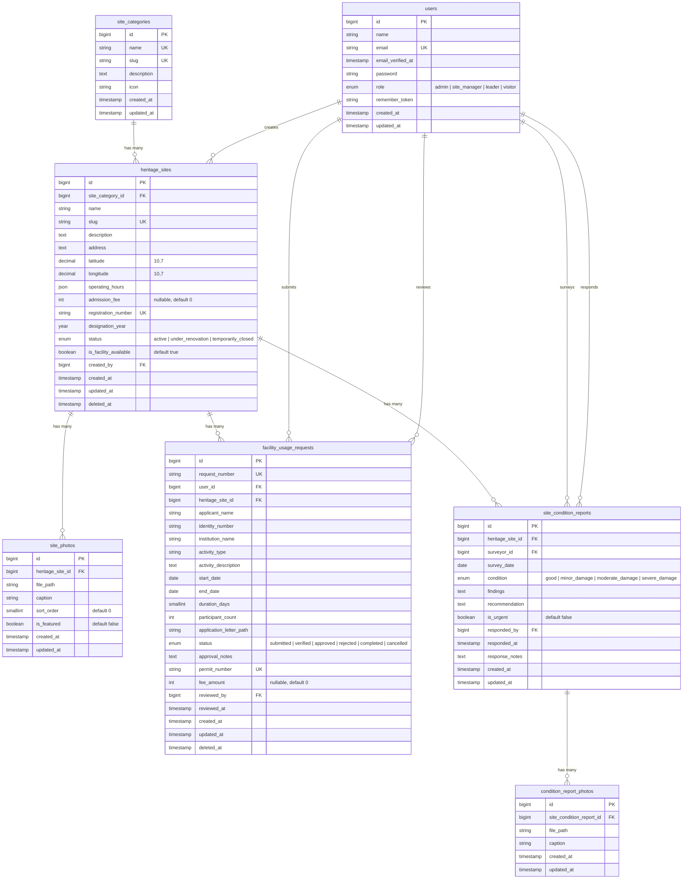

# ERD — Sistem Informasi Layanan Balai Pelestarian Kebudayaan DI Yogyakarta

---

## Keterangan Relasi

| Relasi | Tipe | FK Column | Deskripsi |
|--------|------|-----------|-----------|
| `users` → `heritage_sites` | One-to-Many | `created_by` | User (admin/site_manager) yang menginput situs |
| `site_categories` → `heritage_sites` | One-to-Many | `site_category_id` | Kategori situs (Temple, Cultural Site, dst) |
| `heritage_sites` → `site_photos` | One-to-Many | `heritage_site_id` | Galeri foto situs (cascade delete) |
| `heritage_sites` → `facility_usage_requests` | One-to-Many | `heritage_site_id` | Permohonan penggunaan fasilitas di situs |
| `users` → `facility_usage_requests` | One-to-Many | `user_id` | Pemohon yang mengajukan |
| `users` → `facility_usage_requests` | One-to-Many | `reviewed_by` | Admin/pengelola yang meninjau |
| `heritage_sites` → `site_condition_reports` | One-to-Many | `heritage_site_id` | Laporan kondisi situs |
| `users` → `site_condition_reports` | One-to-Many | `surveyor_id` | Petugas yang melakukan survei |
| `users` → `site_condition_reports` | One-to-Many | `responded_by` | Pimpinan yang merespon laporan |
| `site_condition_reports` → `condition_report_photos` | One-to-Many | `site_condition_report_id` | Foto dokumentasi laporan (cascade delete) |

---

## Ringkasan Tabel

| # | Tabel | Jumlah Kolom | Soft Delete | Keterangan |
|---|-------|-------------|-------------|------------|
| 1 | `users` (modify) | +1 (`role`) | — | Tambah kolom role |
| 2 | `site_categories` | 6 | ✗ | Lookup kategori |
| 3 | `heritage_sites` | 16 | ✓ | Data utama situs |
| 4 | `site_photos` | 7 | ✗ | Galeri foto situs |
| 5 | `facility_usage_requests` | 21 | ✓ | Permohonan fasilitas |
| 6 | `site_condition_reports` | 13 | ✗ | Laporan kondisi (log) |
| 7 | `condition_report_photos` | 5 | ✗ | Foto laporan kondisi |

---
